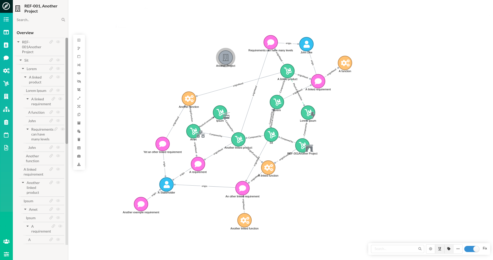
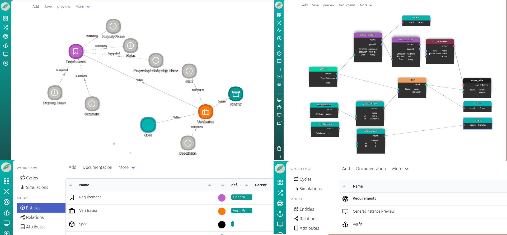
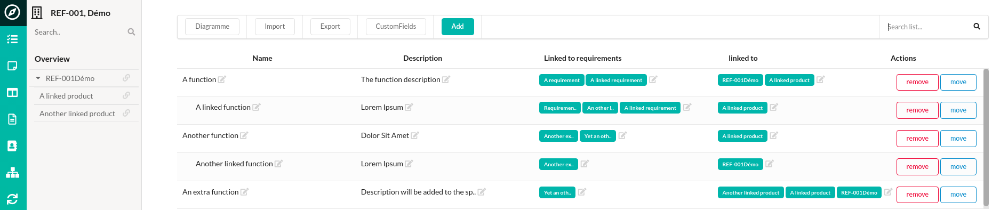
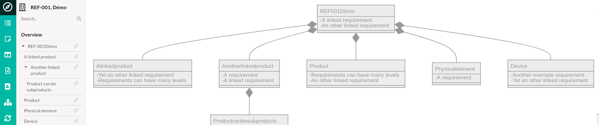
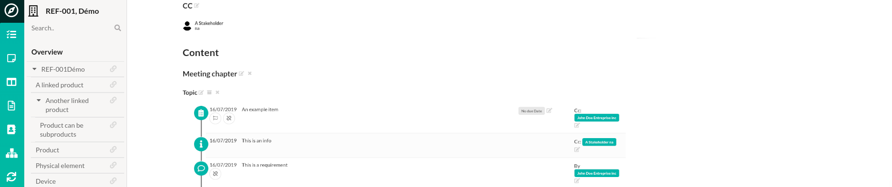
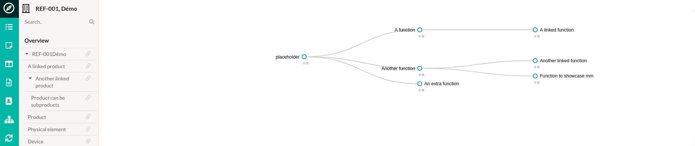
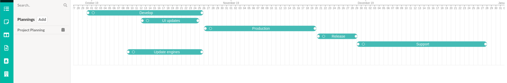
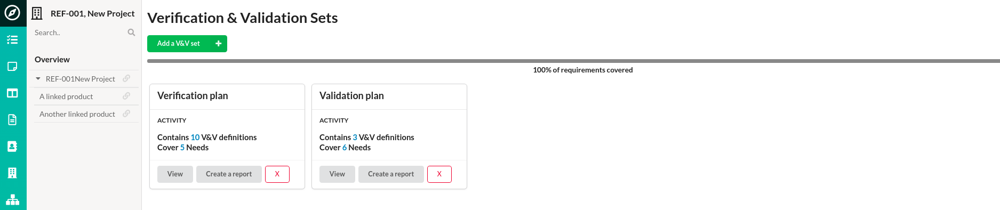
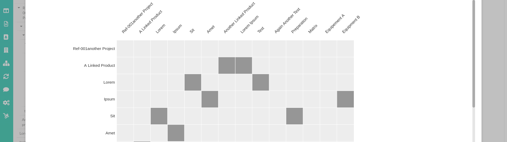

# THIS REPO IS FOR THE WIP ON THE NEXT VERSION OF EPHEMERIS


# Ephemeris

System Engineering and requirements management application.
[Try the web application for a demo](https://www.ephemeris.cloud/demo/)




## Features

### Modeling
-   Generate any model structure depending of your domain
-   Create the needed views using a node editor to manipulate the data you need to display
-   Set up custom pages and define their layouts to group the related views together
-   Perform descreet simulations on your model
-   Use a visual interface to draw the relations between all the entities of your model
-   Create relations directly from the text editors, use them as links between entities, and generates relations graphs automaticaly

### System Engineering
-   Manage Stakeholders, Requirements, Functions and Products in one place and link them together
-   Record Requirements and Actions trough the "meeting" panel
-   Build the project breakdown structure
-   Generate overview diagrams, ERD and mindmaps from the project relations
-   Produce text specifications based on your model
-   Create interfaces matrix from specific part of your project
-   Link pictures and documents to your Products and Requirements
-   Perform V&V on your projects
-   Schedule your projects with Gantt charts and capacity plannings
-   View next actions in a Kanban layout
-   import archimate file to work on existing data or import from CSV using custom scripts










## Getting Started

Download the latest version from the [Release](https://github.com/shuart/ephemeris/releases) page.

Once the appropriate ZIP file has been downloaded for your platform, extract it, run "Ephemeris" and follow the instructions.

- Create a new user. This will be you personal session.
- Fill in your profile
- Once logged in, you can add a new project from the main view. You can go to "Manage projects" in the settings menu to rename, add, or re-order the projects.
- When focused on a project, you can go to different views and edit the projects products, functions and requirements.
- The "Relations" view allow you to edit the project from a network diagram

## Build and run

### install dependencies
```sh
npm install
```

### build nwjs
```sh
npm run build
# Ephemeris will build into "build/release/Ephemeris"
```
